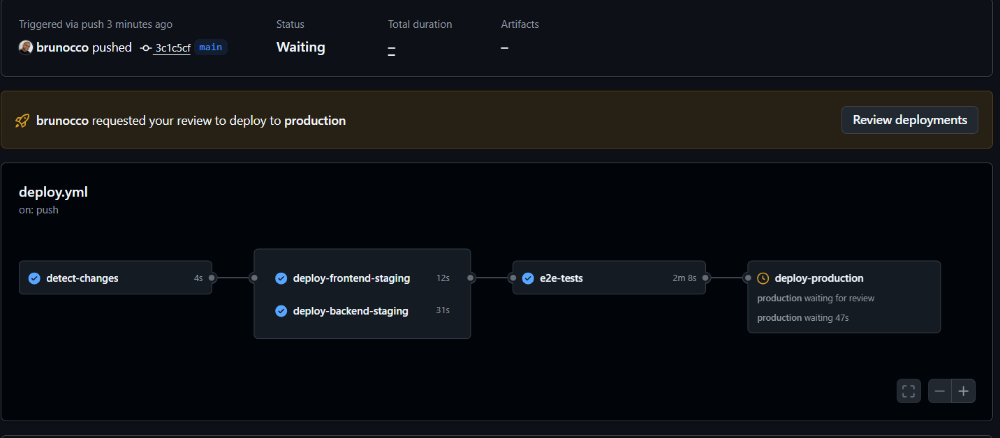
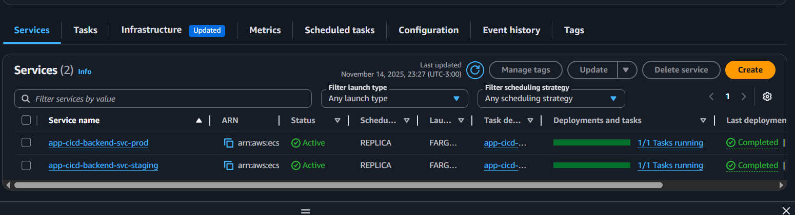
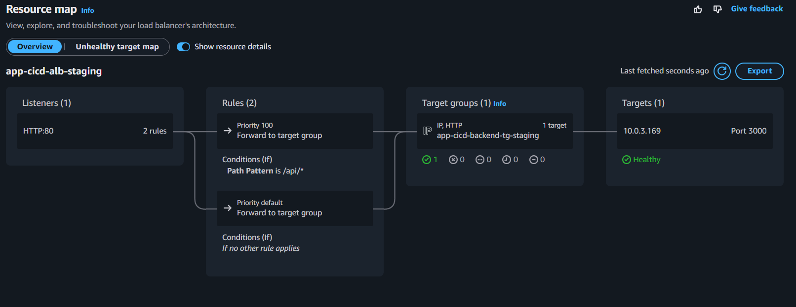
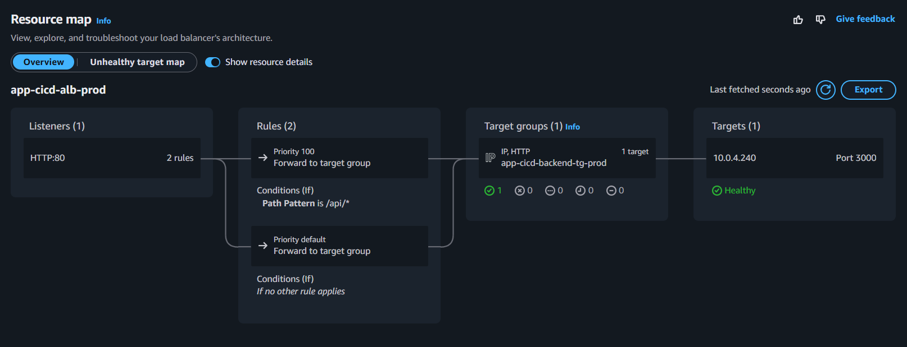
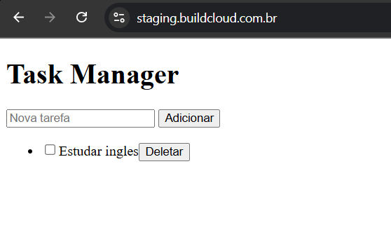
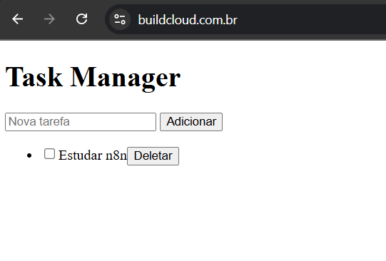

# 🚀 App-CICD - Pipeline Completo Multi-Ambiente na AWS

## 📋 Introdução

**App-CICD** é uma aplicação completa de gerenciamento de tarefas (To-Do List) desenvolvida com foco em demonstrar um **pipeline CI/CD completo** com múltiplos ambientes na AWS. O projeto implementa infraestrutura cloud escalável, segura e de alta disponibilidade com pipeline automatizado, testes E2E e aprovação manual para produção.

### 🎯 Objetivos do Projeto

- **Demonstrar CI/CD completo** com GitHub Actions
- **Pipeline automatizado** que detecta mudanças em frontend/backend
- **Múltiplos ambientes** (staging/production) com aprovação manual
- **Infraestrutura como código** com Terraform
- **Testes automatizados E2E** com Cypress
- **Arquitetura serverless** com ECS Fargate
- **CDN global** com CloudFront + certificados SSL/TLS

---

## 🏗️ Arquitetura da Solução

```
┌─────────────────────────────────────────────────────────────┐
│                     GitHub Actions CI/CD                    │
├─────────────────────────────────────────────────────────────┤
│  1. Detect Changes → 2. Deploy Staging → 3. E2E Tests       │
│                    → 4. Manual Approval → 5. Deploy Prod    │
└─────────────────────────────────────────────────────────────┘
                                ↓
┌─────────────────────────────────────────────────────────────┐
│                        AWS Cloud                            │
├─────────────────────────────────────────────────────────────┤
│  Route53 DNS                                                │
│  ├── staging.buildcloud.com.br → CloudFront (Staging)       │
│  └── www.buildcloud.com.br → CloudFront (Production)        │
│                                ↓                            │
│  CloudFront + ACM (SSL)                                     │
│  ├── S3 Bucket (Frontend Staging)                           │
│  └── S3 Bucket (Frontend Production)                        │
│                                ↓                            │
│  Application Load Balancer                                  │
│  ├── ALB Staging → ECS Backend Staging                      │
│  └── ALB Production → ECS Backend Production                │
│                                ↓                            │
│  ECS Fargate (Backend)                                      │
│  ├── Task Staging → RDS PostgreSQL Staging                  │
│  └── Task Production → RDS PostgreSQL Production            │
└─────────────────────────────────────────────────────────────┘
```

---

## 📁 Estrutura do Projeto

```
app-cicd/
├── .github/workflows/          # GitHub Actions CI/CD
│   └── deploy.yml              # Pipeline principal
├── .amazonq/                   # Configurações Amazon Q (IA)
│   ├── rules/                  # Regras de infraestrutura
│   │   ├── docker-file.md      # Padrões Docker
│   │   ├── infraestrutura.md   # Arquitetura AWS
│   │   ├── naming.md           # Convenções de nomes
│   │   └── pipeline.md         # Regras de CI/CD
│   └── README.md               # Documentação Amazon Q
├── backend/                    # API REST Node.js
│   ├── migrations/             # Scripts SQL
│   ├── app.js                  # Servidor Express
│   ├── Dockerfile              # Container backend
│   └── package.json            # Dependências Node.js
├── frontend/                   # Interface web estática
│   ├── index.html              # Interface HTML
│   ├── app.js                  # Lógica JavaScript
│   └── Dockerfile              # Container frontend (opcional)
├── infra/                      # Infraestrutura Terraform
│   └── main.tf                 # Configuração completa AWS
├── cypress/                    # Testes E2E
│   └── e2e/
│       └── app-test.cy.js      # Testes automatizados
├── cypress.config.js           # Configuração Cypress
├── deploy.bat                  # Deploy manual Windows (opcional)
├── deploy.sh                   # Deploy manual Linux (opcional)
└── README.md                   # Esta documentação
```

---

## ☁️ Recursos AWS Utilizados

### Frontend (Estático)
- **Amazon S3**: Hospedagem de arquivos estáticos (2 buckets)
- **CloudFront**: CDN global com cache e HTTPS
- **ACM**: Certificados SSL/TLS wildcard existentes
- **Route53**: DNS para domínios personalizados

### Backend (Containerizado)
- **Amazon ECS Fargate**: Orquestração serverless (2 ambientes)
- **Application Load Balancer**: Balanceamento HTTP/HTTPS (2 ALBs)
- **Amazon ECR**: Registro privado de containers

### Banco de Dados
- **Amazon RDS PostgreSQL**: Banco gerenciado (2 instâncias)
- **Multi-AZ**: Alta disponibilidade

### Rede e Segurança
- **VPC**: Rede virtual isolada compartilhada
- **Subnets**: Públicas e privadas em múltiplas AZs
- **Security Groups**: Controle granular de tráfego
- **NAT Gateways**: Conectividade de saída segura (2 AZs)

### Observabilidade
- **CloudWatch Logs**: Logs centralizados por ambiente
- **Health Checks**: Monitoramento de saúde dos serviços

---

## 🔄 Pipeline CI/CD

### Trigger do Pipeline
O pipeline é **automaticamente disparado** quando há push de mudanças em:
- **Frontend**: Arquivos em `frontend/`
- **Backend**: Arquivos em `backend/`
- **Ambos**: Se houver mudanças em ambos os diretórios

### Fluxo Automatizado

1. **Detecção de Mudanças** 🔍
   - Monitora alterações em `frontend/` e `backend/`
   - Executa jobs apenas se houver mudanças relevantes

2. **Deploy Staging (Automático)** 🚀
   - **Frontend**: Sync para S3 + invalidação CloudFront
   - **Backend**: Build Docker + push ECR + deploy ECS

3. **Testes E2E (Cypress)** 🧪
   - Testa funcionalidades críticas no staging
   - Valida carregamento da aplicação e criação de tarefas

4. **Deploy Produção (Manual)** ✋
   - Requer aprovação manual no GitHub Actions
   - Deploy idêntico ao staging após aprovação

### Ambientes

| Ambiente | URL | Deploy | Banco | Status |
|----------|-----|--------|-------|--------|
| **Staging** | https://staging.buildcloud.com.br | Automático | RDS Staging | ✅ Ativo |
| **Production** | https://www.buildcloud.com.br | Manual | RDS Production | ✅ Ativo |

---

## 🛠️ Como Replicar o Projeto

### 1️⃣ Pré-requisitos

#### Obrigatórios
- ✅ **Conta AWS** com permissões administrativas
- ✅ **Domínio registrado** (ex: seudominio.com)
- ✅ **Certificados ACM** criados para:
  - `staging.seudominio.com`
  - `www.seudominio.com` ou `seudominio.com`
- ✅ **Route53 Hosted Zone** configurada
- ✅ **GitHub Account** com repositório
- ✅ **AWS CLI** configurado localmente
- ✅ **Terraform** instalado (v1.0+)

#### Opcionais
- 🔧 **Docker** para testes locais
- 🔧 **Node.js** para desenvolvimento local

> Troque os meus dominios Staging: staging.buildcloud.com.br e Produção: www.buildcloud.coom.br pelos seus Dominios ou subdominions ja certificados aprovados.

### 2️⃣ Clone e Configuração Inicial

```bash
# Clone o repositório
git clone https://github.com/brunocco/app-cicd-public.git
cd app-cicd

# Configure suas credenciais AWS
aws configure
```

### 3️⃣ Configurar Domínios e Certificados

#### Certificados ACM (Pré-requisito)
Você deve ter certificados ACM já criados:

```bash
# Listar certificados existentes
aws acm list-certificates --region us-east-1

# Anotar os ARNs dos certificados wildcard
# Exemplo: arn:aws:acm:us-east-1:123456789012:certificate/abc123...
```

#### Route53 Hosted Zone
```bash
# Verificar hosted zone existente
aws route53 list-hosted-zones

# Se não existir, criar
aws route53 create-hosted-zone --name seudominio.com --caller-reference $(date +%s)
```

### 4️⃣ Personalizar Terraform

Edite o arquivo `infra/main.tf`:

```hcl
# Atualizar domínios
variable "domain_names" {
  description = "Domain names for each environment"
  type        = map(string)
  default = {
    staging = "staging.seudominio.com"    # ← Alterar
    prod    = "www.seudominio.com"        # ← Alterar
  }
}

# Atualizar ARN do certificado
locals {
  cert_arn = "arn:aws:acm:us-east-1:<SEU_ID_USUARIOAWS>:certificate/SEU_CERT_ID"  # ← Alterar
}

# Atualizar zona do Route53
data "aws_route53_zone" "main" {
  name         = "seudominio.com"         # ← Alterar
  private_zone = false
}
```

**⚠️ IMPORTANTE**: 
- Substitua `<SEU_ID_USUARIOAWS>` pelo seu AWS Account ID em todos os locais do projeto onde aparecer.
- Substitua `<SUA_SENHA_DB>` por uma senha segura para o banco PostgreSQL (mínimo 8 caracteres).
- Os arquivos `*.tfstate` e `*.backup` estão no `.gitignore` e não serão enviados para o GitHub (contêm informações sensíveis).

### 5️⃣ Provisionar Infraestrutura

```bash
cd infra

# Inicializar Terraform
terraform init

# Planejar mudanças
terraform plan

# Aplicar infraestrutura (15-20 minutos)
terraform apply -auto-approve
```

**⏱️ Tempo estimado**: 15-20 minutos

### 6️⃣ Configurar GitHub Actions

#### Fork do Repositório
1. Faça **fork** do repositório para sua conta
2. Clone seu fork localmente

#### Secrets (Repository → Settings → Secrets and Variables → Actions)
```
AWS_ACCESS_KEY_ID=AKIA...
AWS_SECRET_ACCESS_KEY=...
AWS_ACCOUNT_ID=123456789012
```

#### Variables (Repository → Settings → Secrets and Variables → Actions)
```
AWS_REGION=us-east-1
ECR_REPOSITORY=app-cicd-backend
ECS_CLUSTER=app-cicd-cluster
ECS_SERVICE_STG=app-cicd-backend-svc-staging
ECS_SERVICE_PROD=app-cicd-backend-svc-prod
ECS_TASK_DEFINITION_STG=app-cicd-backend-staging
ECS_TASK_DEFINITION_PROD=app-cicd-backend-prod
```

#### Environments (Repository → Settings → Environments)
1. **Criar environment `staging`** (sem proteção)
2. **Criar environment `production`** com:
   - ✅ **Required reviewers**: Adicionar você mesmo
   - ✅ **Wait timer**: 0 minutes

### 7️⃣ Primeiro Deploy

```bash
# Fazer uma pequena mudança para disparar o pipeline
echo "# Deploy inicial" >> README.md

# Commit e push
git add .
git commit -m "Initial deployment - trigger pipeline"
git push origin main
```

### 8️⃣ Acompanhar Pipeline

1. **Acesse**: https://github.com/SEU_USUARIO/app-cicd/actions
2. **Veja o pipeline executando**:
   - ✅ Detect Changes
   - ✅ Deploy Frontend Staging
   - ✅ Deploy Backend Staging  
   - ✅ E2E Tests
   - ⏳ Deploy Production (aguardando aprovação)

### 9️⃣ Aprovar Deploy Produção

1. **Clique no workflow** em execução
2. **Clique em "Review deployments"**
3. **Selecione "production"**
4. **Clique "Approve and deploy"**

---

## 🧪 Testes E2E

Os testes Cypress validam automaticamente:

- ✅ **Carregamento da aplicação**
- ✅ **Criação de nova tarefa**

### Executar Testes Localmente

```bash
# Instalar Cypress
npm install cypress --save-dev

# Executar testes
npx cypress run

# Interface gráfica
npx cypress open
```

---

## 📊 Monitoramento e Troubleshooting

### CloudWatch Logs
```bash
# Logs do backend staging
aws logs tail /ecs/app-cicd/backend/staging --follow

# Logs do backend produção
aws logs tail /ecs/app-cicd/backend/prod --follow
```

### Status dos Serviços
```bash
# Status dos serviços ECS
aws ecs describe-services --cluster app-cicd-cluster \
  --services app-cicd-backend-svc-staging app-cicd-backend-svc-prod

# Health check dos target groups
aws elbv2 describe-target-health \
  --target-group-arn $(aws elbv2 describe-target-groups \
  --names app-cicd-backend-tg-staging \
  --query 'TargetGroups[0].TargetGroupArn' --output text)
```

### Problemas Comuns

#### Pipeline Falha no Deploy
```bash
# Verificar logs da task ECS
aws ecs describe-tasks --cluster app-cicd-cluster \
  --tasks $(aws ecs list-tasks --cluster app-cicd-cluster \
  --service-name app-cicd-backend-svc-staging \
  --query 'taskArns[0]' --output text)
```

#### Frontend não Carrega
```bash
# Invalidar cache do CloudFront
DISTRIBUTION_ID=$(aws cloudfront list-distributions \
  --query "DistributionList.Items[?Aliases.Items[0]=='staging.seudominio.com'].Id" \
  --output text)

aws cloudfront create-invalidation \
  --distribution-id $DISTRIBUTION_ID --paths "/*"
```

#### Testes Cypress Falhando
- Aguardar 2-3 minutos após deploy para estabilização
- Verificar se o staging está acessível no browser
- Verificar logs do CloudWatch

---

## 🔄 Rollback

### Rollback Automático
- **ECS**: Rollback automático se health check falhar
- **CloudFront**: Cache pode ser invalidado manualmente

### Rollback Manual

#### Backend (ECS)
```bash
# Listar task definitions
aws ecs list-task-definitions --family-prefix app-cicd-backend-staging

# Fazer rollback para versão anterior
aws ecs update-service --cluster app-cicd-cluster \
  --service app-cicd-backend-svc-staging \
  --task-definition app-cicd-backend-staging:REVISION_ANTERIOR
```

#### Frontend (S3)
```bash
# Fazer rollback do frontend (exemplo)
aws s3 sync s3://backup-bucket/frontend/ s3://app-cicd-frontend-staging/
aws cloudfront create-invalidation --distribution-id $DISTRIBUTION_ID --paths "/*"
```

---

## 📸 Screenshots do Pipeline

### 1. Pipeline Completa Esperando Aprovação

*Pipeline executada com sucesso aguardando aprovação manual para produção*

### 2. Pipeline Completa Terminada

*Pipeline totalmente executada após aprovação com todos os checkmarks verdes*

### 3. ECS Services e Tasks Backend Staging e Produção Rodando

*Serviços ECS do backend staging e produção em execução com tasks saudáveis*

### 4. Resource Map ALB Staging

*Load Balancer staging com domínio configurado e targets saudáveis*

### 5. Resource Map ALB Prod

*Load Balancer produção com domínio configurado*

### 6. Aplicação Staging Rodando

*Interface da aplicação funcionando em https://staging.buildcloud.com.br*

### 7. Aplicação Prod Rodando

*Aplicação funcionando em produção em https://www.buildcloud.com.br*

---

## 💰 Estimativa de Custos (Mensal)

| Serviço | Staging | Production | Total |
|---------|---------|------------|-------|
| **ECS Fargate** | $15 | $15 | $30 |
| **RDS t3.micro** | $15 | $15 | $30 |
| **ALB** | $18 | $18 | $36 |
| **NAT Gateway** | $32 | $32 | $64 |
| **CloudFront** | $1 | $5 | $6 |
| **S3** | $1 | $1 | $2 |
| **Route53** | - | $0.50 | $0.50 |
| **ACM** | Gratuito | Gratuito | $0 |
| **ECR** | $1 | $1 | $2 |
| **Total** | - | - | **~$170** |

> **💡 Otimização**: Para desenvolvimento, considere usar 1 NAT Gateway (-$32/mês)

---

## 🚀 Melhorias Futuras

### Segurança
- [ ] Migrar credenciais para AWS Secrets Manager
- [ ] Implementar WAF no CloudFront
- [ ] Habilitar encryption at rest no RDS
- [ ] Adicionar HTTPS redirect no ALB

### Observabilidade
- [ ] Implementar X-Ray para tracing
- [ ] Criar CloudWatch Alarms
- [ ] Configurar SNS para notificações
- [ ] Habilitar Container Insights

### Escalabilidade
- [ ] Configurar Auto Scaling (1-3 tasks)
- [ ] Implementar Application Auto Scaling policies
- [ ] Considerar Aurora Serverless para RDS
- [ ] Adicionar ElastiCache Redis

### CI/CD
- [ ] Implementar testes unitários
- [ ] Adicionar análise de código (SonarQube)
- [ ] Deploy canário ou blue/green
- [ ] Rollback automático baseado em métricas

---

## 🧹 Limpeza de Recursos

```bash
# Destruir toda a infraestrutura
cd infra
terraform destroy -auto-approve

# Limpar buckets S3 manualmente (se necessário)
aws s3 rm s3://app-cicd-frontend-staging --recursive
aws s3 rm s3://app-cicd-frontend-prod --recursive
aws s3 rb s3://app-cicd-frontend-staging
aws s3 rb s3://app-cicd-frontend-prod

# Remover imagens ECR
aws ecr delete-repository --repository-name app-cicd-backend --force
```

---

## 📚 Tecnologias Utilizadas

### Frontend
- **HTML5, CSS3, JavaScript** (Vanilla)
- **Amazon S3** (Hospedagem estática)
- **CloudFront** (CDN)

### Backend
- **Node.js** (Runtime)
- **Express.js** (Framework web)
- **PostgreSQL** (Banco de dados)
- **Docker** (Containerização)

### Infraestrutura
- **AWS ECS Fargate** (Orquestração)
- **AWS RDS** (Banco gerenciado)
- **AWS ALB** (Load balancer)
- **AWS VPC** (Rede)
- **Terraform** (IaC)

### CI/CD
- **GitHub Actions** (Pipeline)
- **Cypress** (Testes E2E)
- **AWS ECR** (Registry)

### Monitoramento
- **CloudWatch** (Logs e métricas)
- **AWS Health Checks** (Monitoramento)

---

## 👤 Autor

**Bruno Cesar**
- 📧 Email: bruno_cco@hotmail.com
- 💼 LinkedIn: [bruno-cesar-704265223](https://www.linkedin.com/in/bruno-cesar-704265223/)
- 🐙 Medium: [brunosherlocked](https://medium.com/@brunosherlocked)

---

## 📄 Licença

Este projeto está sob a licença MIT. Veja o arquivo [LICENSE](LICENSE) para mais detalhes.

---

## 🤝 Contribuições

Contribuições são bem-vindas! Por favor:

1. Faça fork do projeto
2. Crie uma branch para sua feature (`git checkout -b feature/AmazingFeature`)
3. Commit suas mudanças (`git commit -m 'Add some AmazingFeature'`)
4. Push para a branch (`git push origin feature/AmazingFeature`)
5. Abra um Pull Request

---

⭐ **Se este projeto foi útil, considere dar uma estrela no GitHub!**

---

## 📋 Changelog

### v2.1.0 (2024-11-15)
- ✅ Pipeline CI/CD completo implementado
- ✅ Múltiplos ambientes (staging/prod)
- ✅ Testes E2E automatizados
- ✅ Aprovação manual para produção
- ✅ Infraestrutura como código
- ✅ Documentação completa

### v2.0.0 (2024-11-14)
- 🔄 Migração de app-task para app-cicd
- 🚀 Foco em pipeline completo
- 📊 Monitoramento aprimorado

### v1.0.0 (2024-11-13)
- 🎉 Versão inicial do projeto